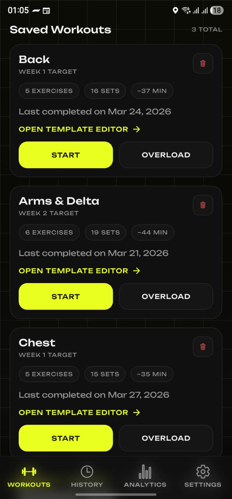
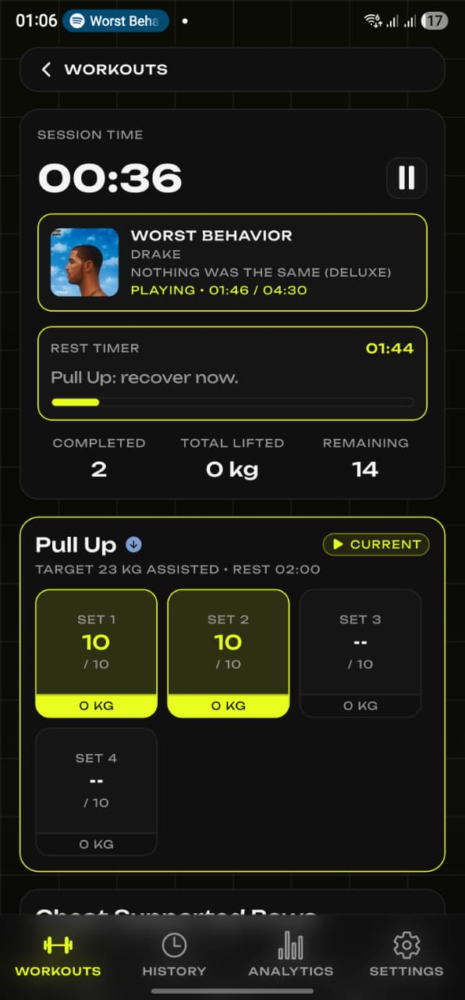
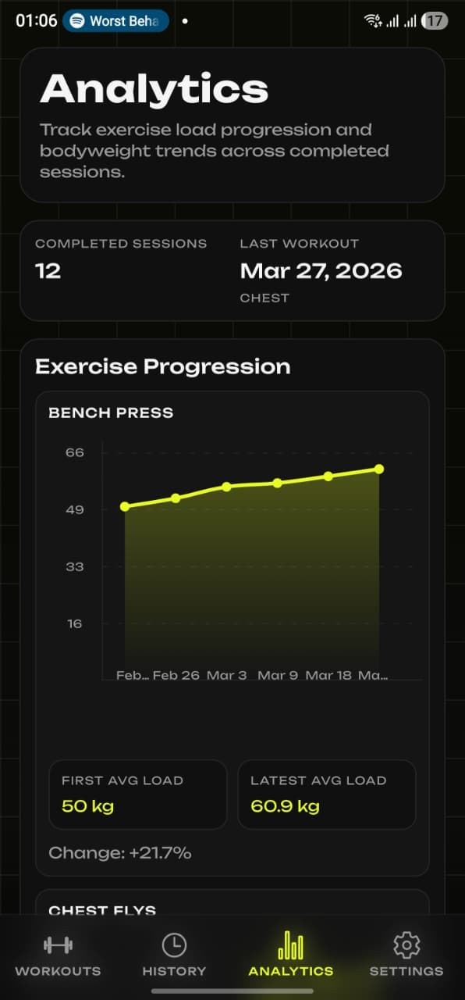
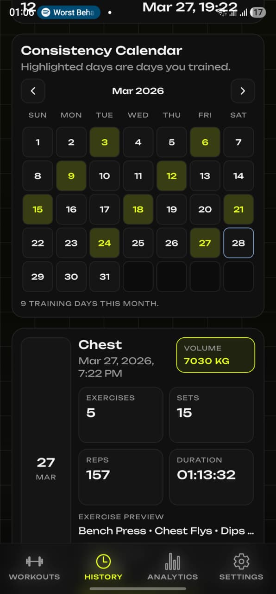

<p align="center">
  
</p>

<h1 align="center">Apex</h1>

<p align="center">
  <strong>Your personal strength training companion</strong><br/>
  Track workouts · Visualize progress · Smash PRs
</p>

<p align="center">
  
  
  
  
  
  
</p>

---

## 📱 Screenshots

<p align="center">
  
  &nbsp;&nbsp;
  
  &nbsp;&nbsp;
  
  &nbsp;&nbsp;
  
</p>

---

## 💪 What is Apex?

Apex is a **clean, fast, and offline-first** workout tracker built for people who take strength training seriously. No subscriptions, no ads — just you and the iron.

Create workout templates, track every set in real time, and watch your progress unfold through beautiful charts. Apex handles progressive overload automatically so you can focus on lifting.

---

## ✨ Features

| | Feature | Description |
|---|---|---|
| 🏋️ | **Workout Templates** | Build reusable routines with exercises, sets, reps, and rest times |
| ⏱️ | **Live Session Tracking** | Real-time set logging with rest timers and push notifications |
| 📈 | **Progressive Overload** | Automatic weekly weight increases — just show up and lift |
| 🔗 | **Supersets** | Pair exercises together for efficient training |
| 📊 | **Analytics & Charts** | Visualize strength gains, volume, and trends over time |
| 📅 | **Calendar History** | See every session at a glance with a calendar view |
| ☁️ | **Google Drive Backup** | Sync your data across devices via Google Drive |
| 🎵 | **Spotify Integration** | Control your music without leaving the app |
| 🔔 | **Smart Notifications** | Rest timer alerts so you never miss a set |
| 🔄 | **OTA Updates** | Get the latest features instantly — no reinstall needed |
| 🌙 | **Themes** | Multiple color themes with dark mode support |
| 📦 | **Fully Offline** | All data stored locally in SQLite — works without internet |

---

## 📲 Download

Grab the latest APK from the [**Releases**](https://github.com/ayushneekhar/Apex/releases/latest) page.

> **Note:** iOS builds are currently available for development only. A TestFlight release is planned.

---

## 🛠️ Tech Stack

| Layer | Technology |
|---|---|
| Framework | React Native 0.81 + Expo 54 |
| Language | TypeScript |
| State | Zustand |
| Database | SQLite (expo-sqlite) |
| Navigation | React Navigation |
| Charts | react-native-gifted-charts |
| OTA Updates | react-native-nitro-ota |
| Auth | expo-auth-session (Spotify, Google) |
| Haptics | react-native-nitro-haptics |

---

## 🏗️ Building from Source

```bash
# Clone the repo
git clone https://github.com/ayushneekhar/Apex.git
cd Apex

# Install dependencies
yarn install

# Start Metro bundler
yarn start

# Run on device/simulator
yarn android
yarn ios
```

### Building an APK locally

```bash
# Debug build
yarn android:apk:debug

# Release build
yarn android:apk:release
```

---

## 🔄 CI/CD

Every push to `main` is triaged automatically by a single CI router:

| Change type | What happens |
|---|---|
| Native files (`android/`, `ios/`, `package.json`, …) | 🏗️ APK build → GitHub Release with tag + notes |
| JS/TS-only files | 📡 Over-the-air update via Nitro OTA |
| Commit contains `[build]` | 🏗️ Forces native build regardless |

No manual steps needed — merge to `main` and the right thing happens.

---

## 📄 License

This project is for personal use. All rights reserved.

---

<p align="center">
  Built with ❤️ by <a href="https://github.com/ayushneekhar">ayushneekhar</a>
</p>
